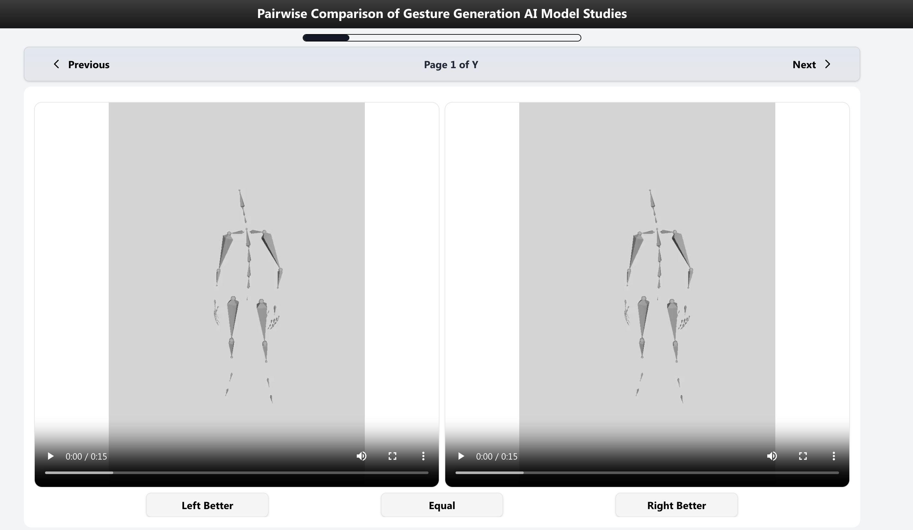

# HemVip2 - Create a Study Experiment to evaluate Gesture Generation AI Model



## Feature support:

**🚩Study status process**

#### Status of study

- Each study have 3 stages `new` -> `started` -> `finish` | `uncomplete`.
- Prolific Participants first click link will redirect to `https://hemvip.vercel.app/?PROLIFIC_PID=662b614c61935111d01484bf&STUDY_ID=665971ec91884faf5b5284d7&SESSION_ID=0cvbkz5w327p`

#### 1. Generate all study screen

- The study **status** change to `new` when first created on `https://genea.vercel.app/private/...`, we will generate all study screen of all AI model privately.

#### 2. Recruit Prolific Participants and Participants start


- Participants click start button at homepage, database will filter and get latest study which status is `new` or `uncomplete`, and update **status** to `started` and redirect to `/prolific` and start study screen.

#### 3. Participants finish study

- Participants select option and at Finish page, submit result to send final result. **status** change to `finish`
  (Study data store in MongoDB collection `studies`)

#### 4. Participants uncomplete study

- Participants not submit after a specific duration (2 hour). **status** change to `uncomplete` after finish.

**🎯 Feature**

- Navigation with keyboard `ArrowLeft`, `ArrowRight`
- Prevent user exist during study
- Support participant study on mobile
- Preview Finish before submit.
- Startup guide screen for participant study.
- Finish screen before submit.
- Screen study have only 3 evalution button: `Left Better`, `Equal`, `Right Better`
- Record all action button click on screen study: `Click Start`, `Click Finish`, `Click Left Better`, `Click Equal`, `Click Right Better`, `Click Previous`, `Click Next`, `Click Finish`, `Click Play Video Left`, `Click Play Video Right`, `Pause Video Left`, `Pause Video Right`, `Seeked Video Left`, `Seeked Video Right`.
- Rewrite structure of MongoDB. (Detail mongodb schema is in `/database`)

## Quick start

### Install

```bash
git clone https://github.com/hmthanh/hemvip2.git
npm i
npm run dev
```

### Database

#### Create your mongodb cluster and udpate url in .env.local file

Edit `env.local`

```bash
MONGODB_URI=mongodb+srv://<USER>:<PASSWORD>@cluster0.bb1owv7.mongodb.net/
```
